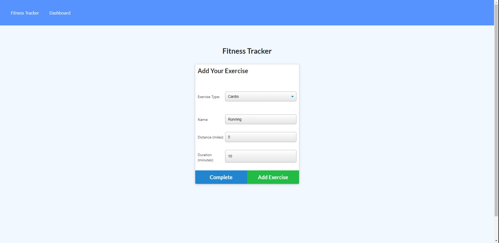

# NoSQLeep-til-Brooklyn

A workout tracker app for the insomniacs

**Version 1.0**

## Note

You are important.

## Installation Instructions

Before running this program:

1. Click on Deployed Website Link provided in links 
2. Click Add Exercise 
3. Fill out fields and add more Exercises or complete! 
4. Enjoy tracking your Fitness!

## Acceptance Criteria

When the user loads the page, they should be given the option to create a new workout or continue with their last workout.

The user should be able to:

- Add exercises to the most recent workout plan.

- Add new exercises to a new workout plan.

- View the combined weight of multiple exercises from the past seven workouts on the `stats` page.

- View the total duration of each workout from the past seven workouts on the `stats` page.

## Media

## Links

- [Deployed Website Link](https://nosqltilbrooklyn.herokuapp.com/?id=61b28250d48ede001620d134)
- [Code Repository Link](https://github.com/AndrewT11/NoSQL-til-Brooklyn/)

## Credits

- Andrew Tran
- Corbin Ball
- BCS Tutor Andrew Hardemon

### Resources

- https://www.w3schools.com/
- https://developer.mozilla.org/en-US/
- https://www.stackoverflow.com
- https://scotch.io/tutorials/keeping-api-routing-clean-using-express-routers

### License

Copyright (c) [2021] [Andrew Tran]

Permission is hereby granted, free of charge, to any person obtaining a copy
of this software and associated documentation files (the "Software"), to deal
in the Software without restriction, including without limitation the rights
to use, copy, modify, merge, publish, distribute, sublicense, and/or sell
copies of the Software, and to permit persons to whom the Software is
furnished to do so, subject to the following conditions:

The above copyright notice and this permission notice shall be included in all
copies or substantial portions of the Software.

THE SOFTWARE IS PROVIDED "AS IS", WITHOUT WARRANTY OF ANY KIND, EXPRESS OR
IMPLIED, INCLUDING BUT NOT LIMITED TO THE WARRANTIES OF MERCHANTABILITY,
FITNESS FOR A PARTICULAR PURPOSE AND NONINFRINGEMENT. IN NO EVENT SHALL THE
AUTHORS OR COPYRIGHT HOLDERS BE LIABLE FOR ANY CLAIM, DAMAGES OR OTHER
LIABILITY, WHETHER IN AN ACTION OF CONTRACT, TORT OR OTHERWISE, ARISING FROM,
OUT OF OR IN CONNECTION WITH THE SOFTWARE OR THE USE OR OTHER DEALINGS IN THE
SOFTWARE.
